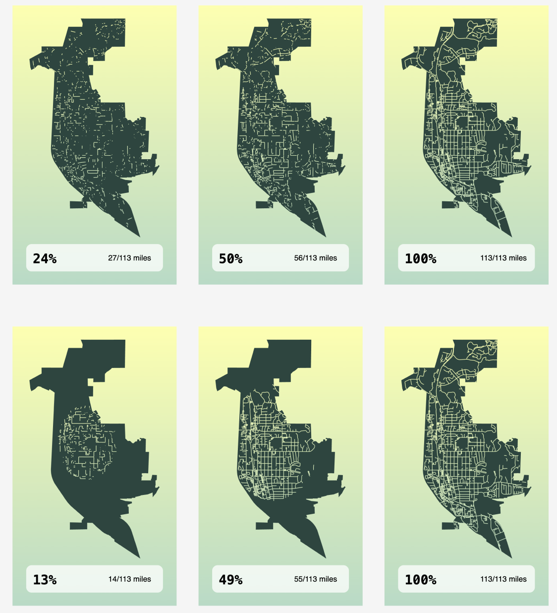

# Zuum

## Run this locally

_Pre-Requisites_

- Docker
- Node v20 and above

### Installation

1. `git clone https://github.com/emergenceland/zuum.git`
2. `cd zuum`
3. `npm install`
4. Start Docker
5. `cd apps/server && npm run db:up`
6. `cd apps/server && npm run dev`
7. `cd apps/client && npm run dev`
